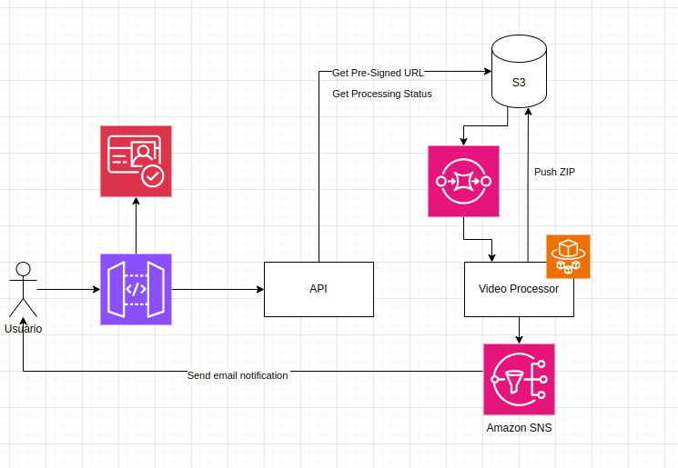

# Documentação
Para esta fase, construímos toda a solução dentro do monorepo hackathon-video-processor-api. A arquitetura é constituída por 2 lambdas functions com Javascript, 1 função em Ruby executada pelo AWS Fargate e diferentes serviços da AWS que tivemos contato durante o curso.

Toda a infraestrutura foi construída com terraform e está organizada dentro do diretório `/infrastructure`.
Abaixo está a documentação detalhada das responsabilidades de cada componente:

##### Cognito
Serviço serverless configurado para permitir sign up e sign in de usuários;
Cria um authorizer que é utilizado pelo API Gateway.

##### Amazon API Gateway
Recebe requisições na rota POST {{host}}/prod/upload e atua como ponto de entrada da aplicação;
Aplica a autenticação criada pelo Cognito para que somente usuários autenticados possam executar as requisições;

Rotas disponibilizadas pela aplicação: 
```
POST {{host}}/prod/upload
GET {{host}}/prod/videos
```

##### Lambdas
1. Lambda  `pre_signed_url-lambda`, responsável por gerar a URL pré-assinada para upload de vídeo, utilizando um UUID como identificador. Essa function usa conceitos de clean architecture, com adapters, ports e use cases.
2. Lambda `list_processing_status-lambda`, responsável por acessar os vídeos através do endpoint /videos.

##### Amazon S3
- Armazena o vídeo enviado pelo usuário via URL pré-assinada;
- Dispara notificações de evento quando o upload é concluído;
- Armazena os frames extraídos pelo serviço de processamento em um bucket separado.

##### Video Processor
- É executado em uma task do AWS Fargate;
- Escuta um evento de upload de MP4 no S3 e processa esse evento para transformar esse MP4 em um zip de frames com as imagens do MP4 e chama o AWS SNS para notificar o usuário sobre o resultado do processamento.

#### Fluxo Completo



1. Upload do Vídeo:
Usuário → API Gateway (POST /upload) → Lambda (gera URL S3) → Upload via URL pré-assinada.
Processamento:
S3 (dispara evento) → Fargate (extrai frames) → S3 (armazena resultados).

2. Notificação:
Fargate (sinaliza conclusão) → SNS (publica em tópico) → E-mail do usuário

3. Consulta de vídeos
